# SNACBox
Note: Repository had to be rebuilt on 31-07-25<br><br>
Simple Network Access Control Box (SNACBox) is a home router designed to provide access to child safe websites, protect devices and restrict access to the internet based on the users devices. The hope is that SNACBox can  help parents and guardians creating as child safe internet experiance.

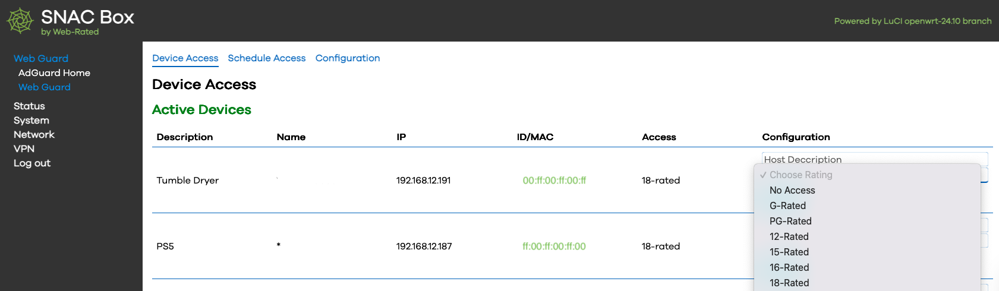

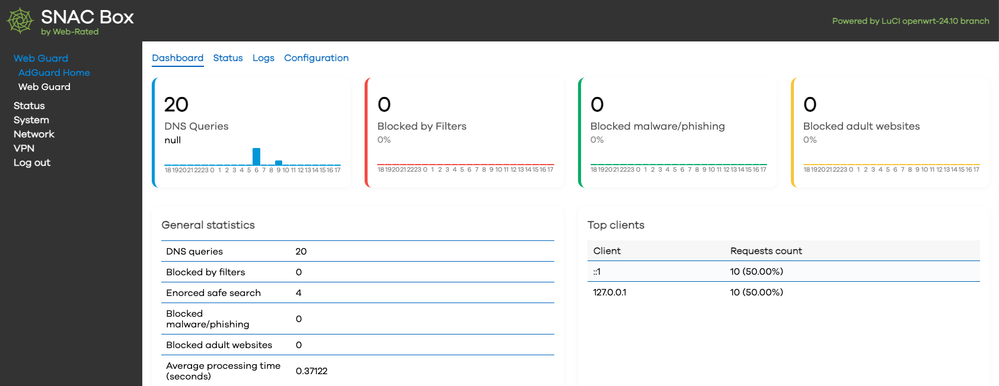

# Open Source Components
<h3>OpenWRT</h3> - https://openwrt.org/<br>
    The OpenWrt Project is a Linux operating system targeting embedded devices to create an router. <br>
<h3>AdguardHome</h3> - https://github.com/AdguardTeam/AdGuardHome<br>
    Free and open source, powerful network-wide ads & trackers blocking DNS server.<br>
<h3>Docker</h3> - https://www.docker.com/community/open-source/<br>
    Docker is built for developers, by developers. We enable team collaboration, efficient packaging, and scalable distribution of open-source projects, all with a focus on trust and security.<br>
<h3>e2Guardian</h3> - https://github.com/e2guardian/e2guardian<br>
    e2guardian is a content filtering proxy that can work in explicit and transparent proxy mode or as a ICAP server mode.<br>
<h3>Unbound</h3> - https://www.nlnetlabs.nl/projects/unbound/about/<br>
    Unbound is a validating, recursive, caching DNS resolver.<br>
<h3>PHP</h3> - https://www.php.net/<br>
    A popular general-purpose scripting language that is especially suited to web development. Fast, flexible and pragmatic, PHP powers everything from your blog to the most popular websites in the world.<br>

# Supported Hardware
<h2>Raspberry Pi CM4 SNACBox</h2>
<h3>Waveshare</h3> - https://www.waveshare.com/cm4-dual-eth-mini.htm?sku=23853<br>
    Mini Dual Gigabit Ethernet Base Board/Mini-Computer Designed for Raspberry Pi Compute Module 4.<br>
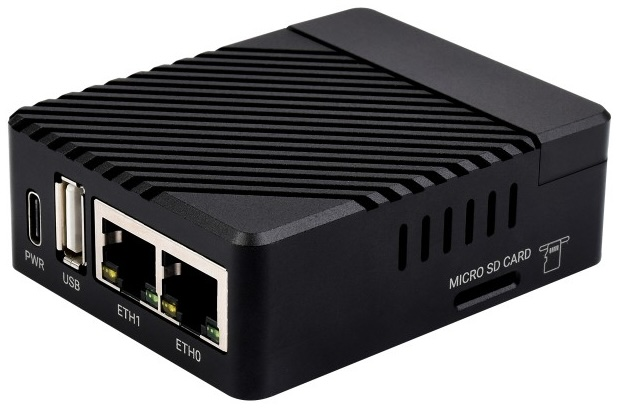<br>    
<h3>Raspberry Pi</h3> - https://www.raspberrypi.com/products/compute-module-4/?variant=raspberry-pi-cm4001000<br>
    The power of Raspberry Pi 4 in a compact form factor for deeply embedded applications. Raspberry Pi Compute Module 4 incorporates a quad-core ARM Cortex-A72 processor, dual video output, and a wide selection of other interfaces<br>

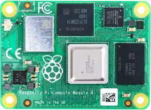<br>

<h2>Raspberry Pi CM5 SNACBox</h2>
<h3>Waveshare</h3> - https://www.waveshare.com/cm5-dual-eth-mini.htm?sku=31075<br>
    Mini Dual Gigabit Ethernet Base Board/Mini-Computer Designed for Raspberry Pi Compute Module 5.<br>
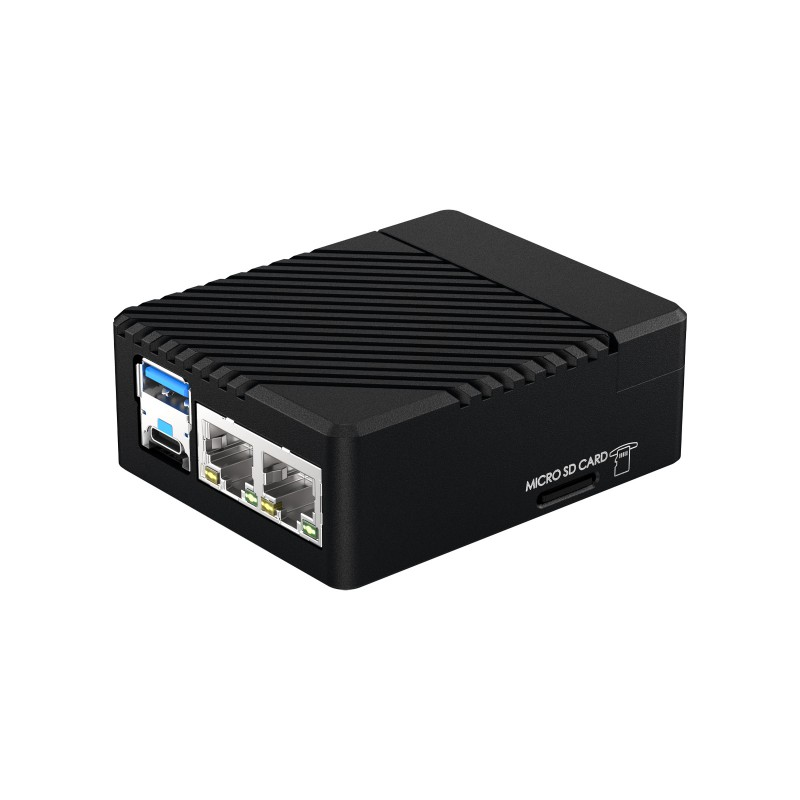    
<h3>Raspberry Pi</h3> - https://www.raspberrypi.com/products/compute-module-5/?variant=cm5-104032<br>
    Compute Module 5 is a powerful and scalable system on module with a 64-bit Arm processor @ 2.4GHz, an I/O controller, video and PCIe interfaces, and a range of wireless, SDRAM and eMMC options

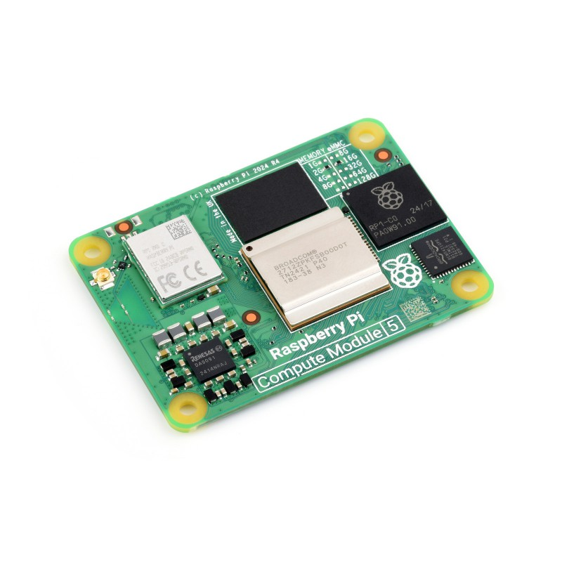

<h2>Raspberry Pi 4B SNACBox (Devolpment)</h2>
<h3>Waveshare</h3> - https://www.waveshare.com/usb-3.2-gen1-hub-gigabit-eth-hat.htm<br>
    USB 3.2 Gen1 and Gigabit Ethernet HUB HAT for Raspberry Pi, 3x USB 3.2 Gen1, 1x Gigabit Ethernet, driver-free.<br>
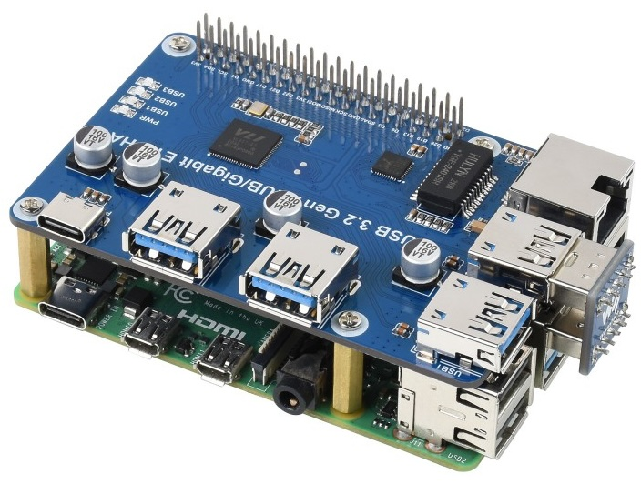<br>
Or<br>
<h3>USB Ethernet Dongle</h3>
    Needs to be a USB-A Ethernet Gigabit dongle.
<h3>Raspberry Pi</h3> - https://www.raspberrypi.com/products/raspberry-pi-4-model-b/<br>
    Your tiny, dual-display, desktop computer …and robot brains, smart home hub, media centre, networked AI core, factory controller, and much more<br>


<h2>Raspberry Pi 5 SNACBox (Devolpment)</h2>
<h3>Waveshare</h3> - https://www.waveshare.com/pcie-to-gigabit-eth-usb3.2-hat-plus.htm<br>
    PCIe To Gigabit Ethernet And USB 3.2 Gen1 HAT For Raspberry Pi 5, 3x USB 3.2 Gen1, 1x Gigabit Ethernet, Driver-Free, Plug And Play, Raspberry Pi 5 PCIe HAT.<br>
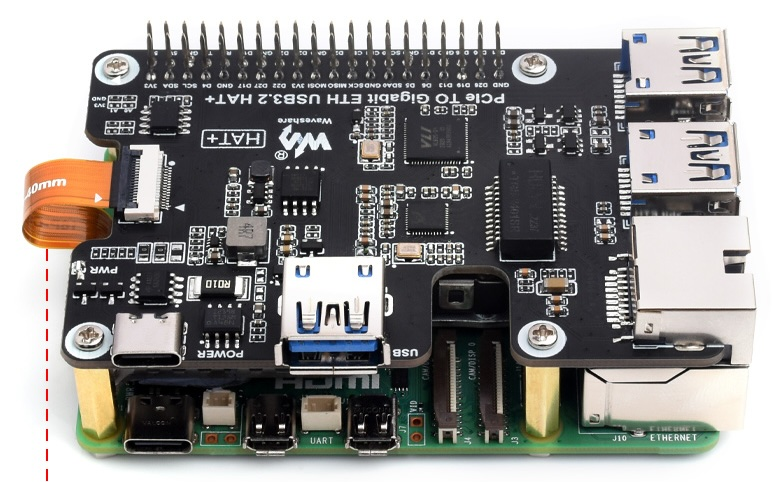<br>
Or<br>
<h3>USB Ethernet Dongle</h3>
    Needs to be a USB-A Ethernet Gigabit dongle.
<h3>Raspberry Pi</h3> - https://www.raspberrypi.com/products/raspberry-pi-5/<br>
    The everything computer. Optimised. With 2–3× the speed of the previous generation, and featuring silicon designed in‑house for the best possible performance, we’ve redefined the Raspberry Pi experience.<br>


<h2>GL iNet Brume 2 (GL-MT2500) (Expermental)</h2>
<h3>Brume 2</h3> - https://store-eu.gl-inet.com/products/brume-2-gl-mt2500-vpn-security-gateway<br>
    Brume 2 (GL-MT2500/GL-MT2500A) is a lightweight and powerful VPN Gateway that runs on OpenWrt v21.02 operating system. It is compactly designed to host a VPN server at home, or run SD-WAN (Site-to-Site) for small and medium-sized enterprises.<br>
<br>Note: will need Luci installed to work.
    
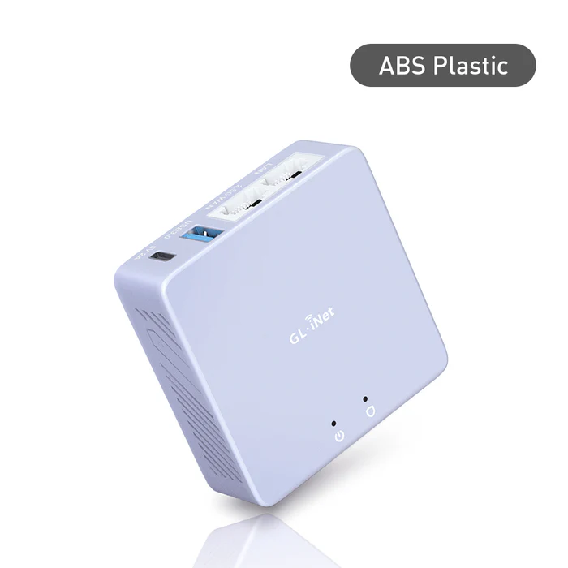<br>
<br>

<h2>OpenWRT One SNACBox (Expermental)</h2>
<h3>Banana Pi</h3> - https://docs.banana-pi.org/en/OpenWRT-One/BananaPi_OpenWRT-One<br>
    The “OpenWrt One/AP-24.XY” router board based on MediaTek MT7981B (Filogic 820) SoC and MediaTek MT7976C dual-band WiFi 6 chipset.It is the first official development board of the OpenWRT open source community<br>
<h3>M.2 NVME SSD M Key</h3>
    Needs a small 2230 or 2242 NVME SSD to handle the larger apps like Docker and ADGuardHome
    Note: This box has not been fully tested yet.

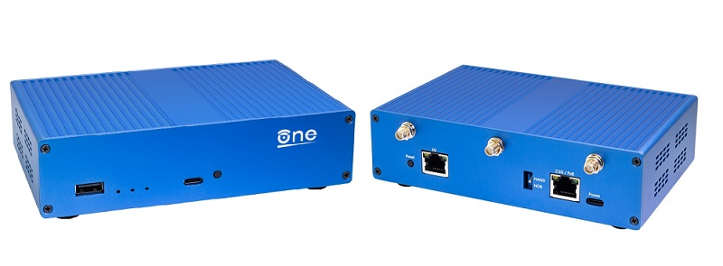

# Design
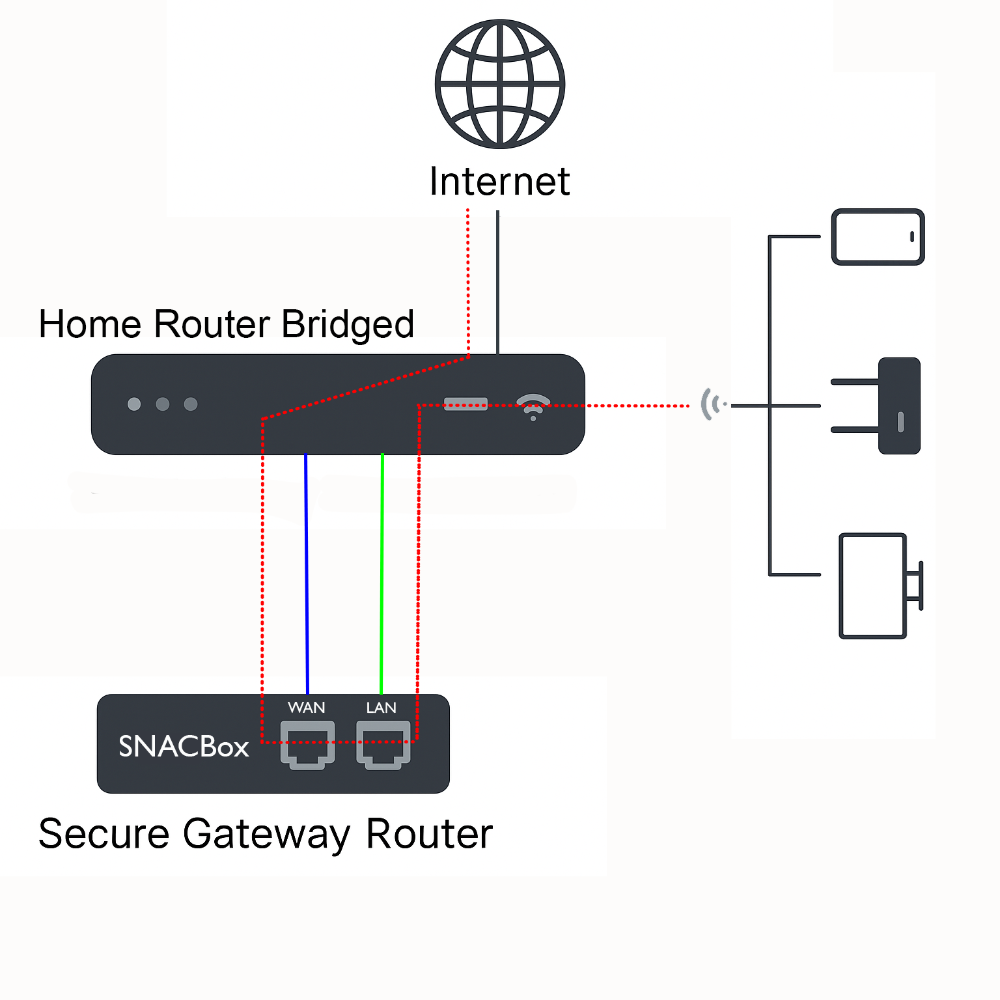

<h2>How it works</h2>
When a device connects to the SNACBox OpenWRT it will get a DHCP address. Once the client device resgisters with the SNACBox it can then be configured into one of 6 catorgies or ratings (G, PG, 12, 15, 16 ,18). When a client device want to connect to the internet it must first be porcessed by the SNACBox rules.<br><br>
In this example we will use the G rating as example.<br>
The G device send a request to access a website. OpenWRT Firewall will forward the requests (80 HTTP, 443 HTTPS, 53 DNS) to a Docker container.<br>
The G docker container runs 2 services, E2Guardian Proxy and Unbound DNS.<br>
The G docker container processes the DNS requests and fowards them to ADGuardHome for processing.<br>
ADGuardHome will have a set of filter rules (Child safe websites, Specific restricted services and Safe Search) setup for the G docker container.<br>
ADGuardHome processes the DNS request, based on the filter rules, if the request is fowards to the internet ADGuardHome using DOH (DNS over HTTPS).<br>
If ADGuardHome DNS returns the address to the site requested then the G docker container will permit the HTTP/HTTPS request access the internet.<br>
If ADGuardHome DNS does not return the address to the site requested then the G docker container will close the request and the HTTP/HTTPS will go nowhere.<br>
<h3>Note:</h3> The reason for the E2Guardian Proxy is to provent DNS bypass by using DOH on the client device.

# Configurating SNACBox
Please follow the steps below to setup SNACBox.<br>
Or<br>
download the <a href="https://drive.google.com/file/d/1quPlqnDdQsepP0njJgEDzNFuD2EQDK10/view?usp=sharing">SNACBox-OpenWRT-0.9.42.69.img</a> 
<br>Raspberry Pi CM4 SNACBox or Raspberry Pi 4B SNACBox (Devolpment) compatible.<br>
Complete steps 1 and 2 (SD card onwards) then proceed to 'Setup SNACBox on Home Network Router'
<h2>Step 1</h2>
Chooses from the Pi CM4 or the Pi CM5 hardware.<br>
It is also possible to complete the next steps using the Pi 4 or Pi 5 hardware<br>
If you choose the Banana Pi OpenWRT One follow their Firmware Flashing guidlines, once OpenWRT is installed proceed to step 5<br>
<h2>Step 2</h2>
Download and flash the SD card.<br>
Goto https://firmware-selector.openwrt.org<br>
Enter "Raspberry Pi"<br>
Select based on the Hardware choice made e.g "Raspberry Pi 4B/400/CM4 (64bit)"<br>
Choose "Customize installed packages"<br>
Add "kmod-usb-net-rtl8152 parted losetup resize2fs blkid" to the end of the list<br>
Click "Request Build"<br>
Click and download "Factory (Ext4)"<br>
Get SD Card min 16GB<br>
Download and install Raspberry Pi imager https://www.raspberrypi.com/software/<br>
Insert SD card into computer or adapter<br>
Run Raspberry Pi Imager<br>
<br>
Click "Select Hardware"
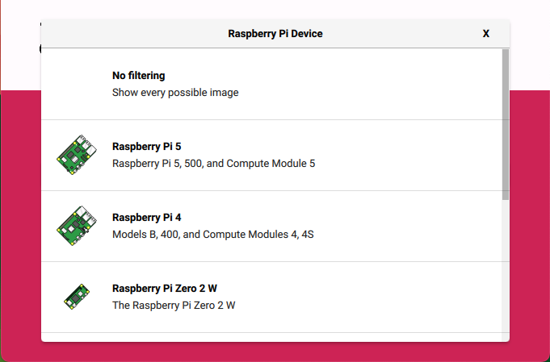<br>
Choose Hardware
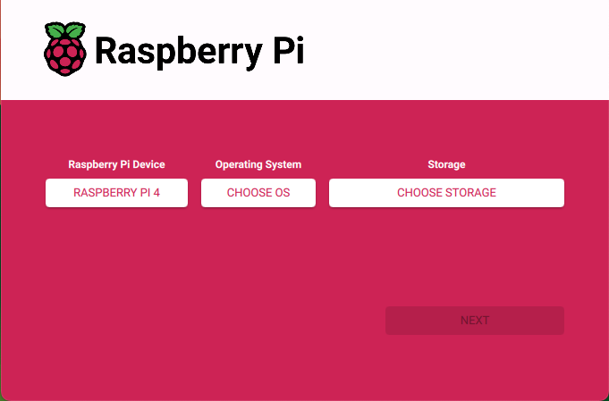<br>
Click "Select OS"
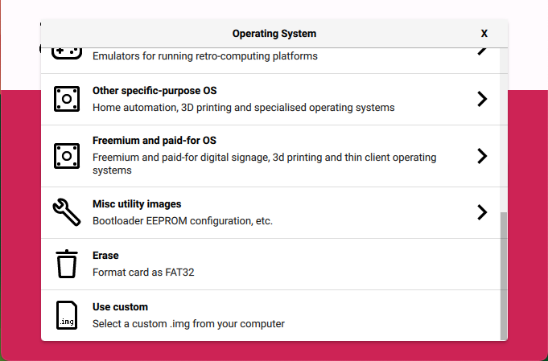<br>
Choose "Custom Image"
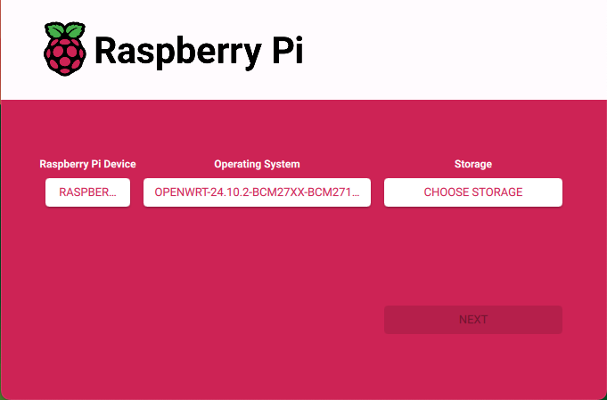<br>
Click "Select Storage"
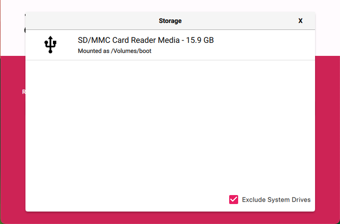<br>
Choose SD Card
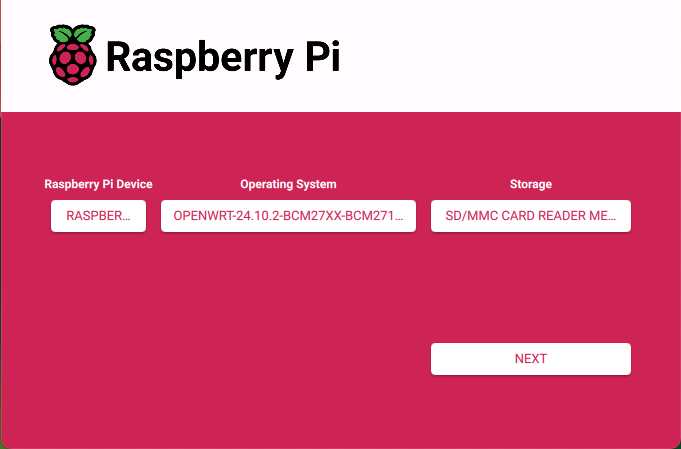<br>
Click "No" to customise OS
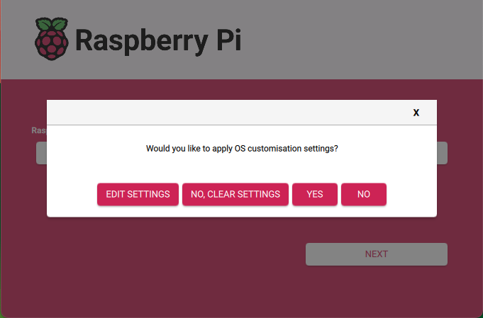<br>
Click "Complete"
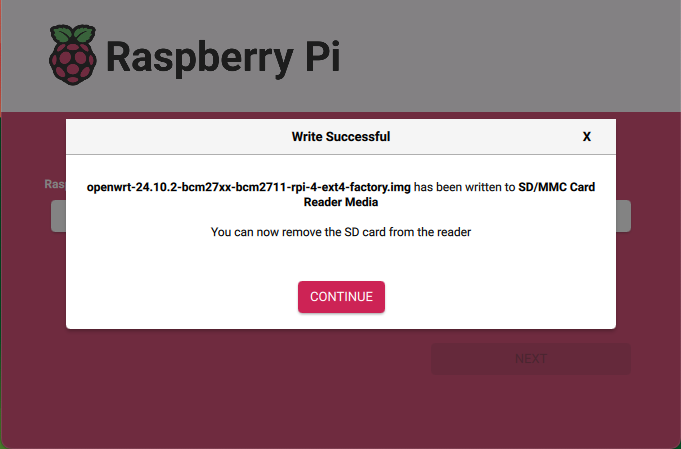<br>
Now the SD card is almost ready for use in the device<br>
Make sure you device is not connected to network or power
<h2>Setp 3</h2>
Insert SD card into device<br>
If the device has HDMI, connect it to a monitor and keyboard<br>
<h2>Step 4</h2>
Power on or Boot device<br>
Connect LAN port directly to a computer, the device will provide computer with new DHCP address<br>
Open web browser on computer and enter http://192.168.1.1 to access OpenWRT<br>
If computer does not get new DHCP address then WAN port was connected<br>
SSH to root@192.168.1.1 or use HDMI and Keyboard
Run the command 'ifconfig -a' and you should see the IP address and network ports<br>
Connect WAN port to local network using second ethernet cable<br>
Configure the ethx without IP (WAN Port) for DHCP<br>
<br>Configure OpenWRT Password

```bash
passwd
```

Enter Password = xxxxxxx<br>
Note: Enter this password later into the Web Guard - Configuration section of the WebRated App software.<br>
<br>Configure WAN for DHCP

```bash
uci set network.eth1=interface
uci set network.eth1.ifname='eth1'
uci set network.eth1.proto='dhcp'
uci commit network
/etc/init.d/network restart
```

<br>Run the command 'ifconfig -a' and you should see the IP address

```bash
ifconfig -a
```

<h2>Step 5</h2>
Stop the firewall using the command '/etc/init.d/firewall stop'

```bash
/etc/init.d/firewall stop
```

<br>Disable the firewall using the command '/etc/init.d/firewall disable'

```bash
/etc/init.d/firewall disable
```
<br>Optional:
<br>If this worked and WAN has IP address disconnect the LAN cable form the computer
<br>Now SSH on to the device using the WAN IP
<h2>Step 6</h2>
Resize the SD card partition<br>
<br>Download expand-root.sh

```bash
wget -U "" -O expand-root.sh "https://openwrt.org/_export/code/docs/guide-user/advanced/expand_root?codeblock=0"
```

<br>Source the script (creates /etc/uci-defaults/70-rootpt-resize and /etc/uci-defaults/80-rootpt-resize, and adds them to /etc/sysupgrade.conf so they will be re-run after a sysupgrade)

```bash
chmod +x expand-root.sh
./expand-root.sh
```

<br>Resize root partition and filesystem (will resize partiton, reboot resize filesystem, and reboot again)

```bash
sh /etc/uci-defaults/70-rootpt-resize
```

<br>
SSH connection will close and it can take 2 minutes for resize to happen
<br>
SSH back onto the device.<br>
Run command 'df -h' to check the disk space

```bash
df -h
```

# Install SNACBox Software
After the creation of the OpenWRT device the software necessary needs to be installed and configured to create the SNACBox.<br>
Download the contents of the software folder either as a zip file or clone the git respository to the OpenWRT device.<br>

```bash
opkg update
opkg install git git-http
git clone https://github.com/AKrawczyk/SNACBox.git
```

If its in zip format extract and goto the software folder.<br>
The software folder contains all the setup files and software needed to create a SNACBox.<br>
<br>Make script files executable

```bash
chmod +x *.sh
```

<h2>Step 1</h2>
ADGuardHome
<br>This will install and configure ADGuardHome on OpenWRT.

```bash
./adguardhome-setup.sh
```

<br>Test ADGuardHome setup
<br>If connected to LAN use http://192.168.1.1.3080
<br>If connected to WAN use http://WAN_IP:3080
<br>User = root
<br>Password = xxxxxxxx
<br>Note: Set this password later into the AdGuard Home - Configuration section of the WebRated App software.
<br>If everthing worked there should be access to ADGuardHome web interface<br>
Do not proceed unless the ADGuardHome works.<br>
<h2>Step 2</h2>
Docker
<br>This will install, configure, get all containers and run all containers needed.
<br>NOTE: e2Guardian configuration files need to be updated as they are not work currently

```bash
./docker-setup.sh
```

<br>Test DNS Docker Container
<br>Once the setup script has been run the docker containers will need to be tested.

```bash
nslookup www.youtube.com 172.20.0.16
```

<br>All the following nslookup results should be diffrent.

```bash
nslookup www.youtube.com 172.20.0.11 
nslookup www.youtube.com 172.20.0.12
nslookup www.youtube.com 172.20.0.13
nslookup www.youtube.com 172.20.0.14
nslookup www.youtube.com 172.20.0.15
```

<br>Test Proxy Docker Container

```bash
opkg install curl
curl -x http://172.20.0.11:8080 https://www.google.com
curl -x http://172.20.0.12:8080 https://www.google.com
curl -x http://172.20.0.13:8080 https://www.google.com
curl -x http://172.20.0.14:8080 https://www.google.com
curl -x http://172.20.0.15:8080 https://www.google.com
```

Do not proceed unless the docker containers work.<br>
<h2>Step 3</h2>
Web Rated App<br>
Create OpenWRT App folders

```bash
mkdir -p /usr/lib/lua/luci/controller
mkdir -p /usr/lib/lua/luci/view
mkdir -p /www/html
grep -q ' config webguard' /etc/config/webguard 2>/dev/null || { echo ' config webguard' >> /etc/config/webguard }
```

<br>To install the Web Rated App copy web rated folders

```bash
cp -r /root/SNACBox/software/"Web Rated"/web-rated/*.* /www/html/
mv /www/html/config.js /www/luci-static/resources/view/
cp -r /root/SNACBox/software/"Web Rated"/controler/*.* /usr/lib/lua/luci/controller/
cp -r /root/SNACBox/software/"Web Rated"/view/*.* /usr/lib/lua/luci/view/
opkg update
opkg install luci-app-openvpn
opkg install php8 php8-cli php8-mod-curl luci-mod-rpc
opkg install luci-ssl at jq
uci set uhttpd.main.redirect_https=1
uci commit uhttpd
/etc/init.d/uhttpd restart
```

login to OpenWRT<br>
Goto Web Guard -> Configuration<br>
Enter root password<br>
Click 'Save and Apply'<br>
Click on Web Guard

<h2>Step 4</h2>
SNACBox theme<br>
Install OpenWRT 2000 Theme

```bash
opkg update
opkg install luci-theme-openwrt-2020
```

<br>To create custom theme copy theme folders

```bash
cp -r /root/SNACBox/software/OpenWRT-Theme/luci-static/snacbox-theme/ /www/luci-static/
ls /www/luci-static/snacbox-theme/
cp -r /root/SNACBox/software/OpenWRT-Theme/view/themes/snacbox-theme /usr/share/ucode/luci/template/themes/
```

<br>To enable custom theme

```bash
uci set luci.main.mediaurlbase='/luci-static/snacbox-theme'
uci commit luci
service uhttpd restart
```

<h2>Step 5</h2>
<br>Install and configure luci-app-adguardhome app for SNACBox

```bash
git clone https://github.com/AKrawczyk/luci-app-adguardhome.git
cd luci-app-adguardhome/SNACBox
chmod +x install-SNACBox-adguardianhome.sh
./install-SNACBox-adguardianhome.sh
cd /root
git clone https://github.com/AKrawczyk/twin-bcrypt.git
cd twin-bcrypt
cp twin-bcrypt.min.js /www/luci-static/resources/view/
```

Login to OpwnWRT and see SNACBox theme<br>
Goto AdGuard Home -> Configuration<br>
Enter username and password to ADGuardHome<br>
Click 'Change Password' button<br>
Click 'Save and Apply'<br>
Goto AdGuard Home -> Status<br>
Click on ADGuardHome button<br>
Login to ADGuardHome Web UI

<h2>Step 6</h2>
Deamons<br>
Setup the Dcoker maintainer deamon

```bash
cd /root/SNACBox/software/Daemon/docker-checker-daemon
chmod +x *.sh
./docker-checker-setup.sh
```

<br>Setup but dont enable the New Device Access daemon

```bash
cd /root/SNACBox/software/Daemon/new-device-access-daemon
chmod +x *.sh
./new-device-access-setup.sh
```

<br>Optional: Setup the Mobile WAN daemon

```bash
cd /root/SNACBox/software/Daemon/moibile-wan-daemon
chmod +x *.sh
./mobile-wan-setup.sh
```

<h2>Step 7</h2>
Newtwork Interfaces and Firewall configuration<br>
<br>Setup and enable network interfaces<br><br>
If connected to LAN use http://192.168.1.1<br>
User = root<br>
Password = xxxxxx<br><br>
At login a popup will appear informing it needs to do a reconfigure, Agree to this and proceed<br><br>
Click on 'Network -> Interfaces'<br>
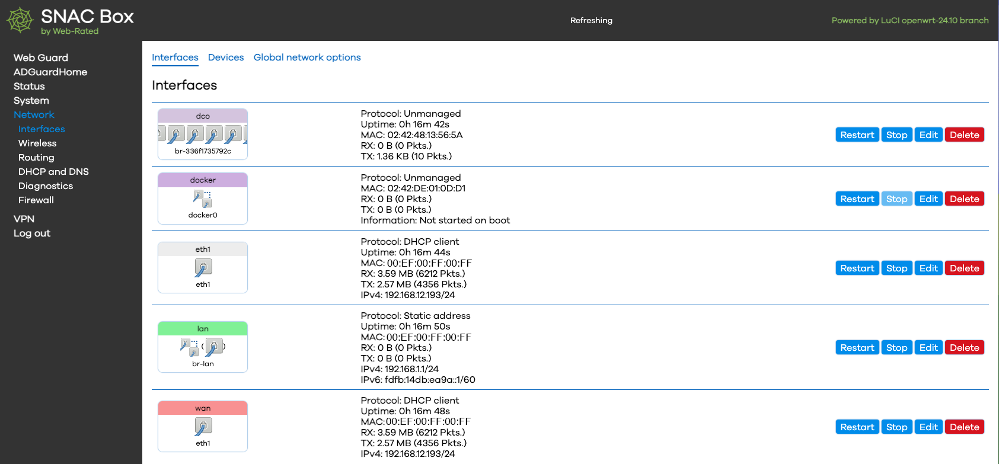
There are two interface that need to be enabled<br>
'DCO' and 'WAN'<br><br>
Find 'DCO'<br>
On the right hand side click on 'Edit'<br>
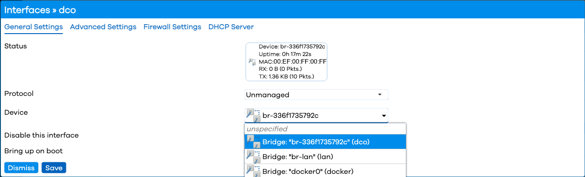
Find 'Device' Drop down<br>
Select 'br-xxxxxxxxx'<br>
Click 'Save'<br><br>
Find 'WAN'<br>
On the right hand side click on 'Edit'<br>
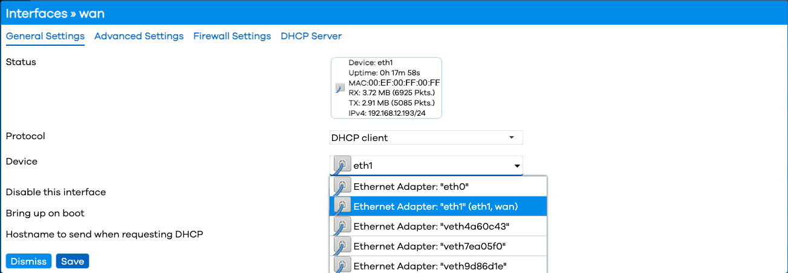
Find 'Device' Drop down<br>
Select 'eth1'<br>
Click 'Save'<br><br>
Note: This part must be done by a device connected to the LAN port<br>
Find 'eth1'<br>
On the right hand side click on 'Edit'<br>
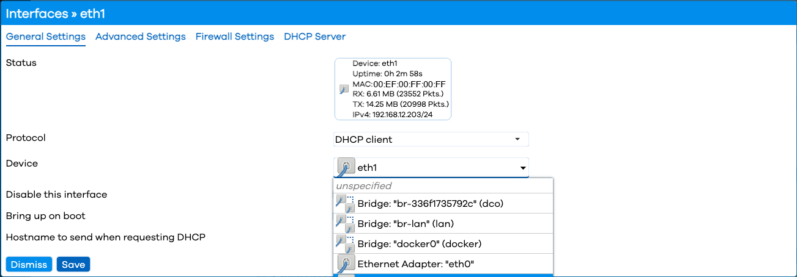
Find 'Device' Drop down<br>
Select 'unspecified'<br>
Click 'Save'<br>
Click 'Save and Apply'<br>
On the right hand side click on 'Delete'<br>
Click 'Save and Apply'<br><br>

<br>Setup and enable firewall

```bash
cp /root/SNACBox/software/firewall/firewall /etc/config/
/etc/init.d/firewall enable
/etc/init.d/firewall start
/etc/init.d/firewall status
```

<br>Enable New Device Access daemon

```bash
/etc/init.d/new-device-access enable
/etc/init.d/new-device-access start
/etc/init.d/new-device-access status
```

<h2>Step 8</h2>
IP Blacklist<br>
Enable IP Blacklist Scheduled task<br>

```bash
cd /root/SNACBox/software/cronjob/blacklist-ip/
chmod +x *.sh
./setup-blacklist-ip.sh
```

Note: This updates a firewall rule to drop any outbound traffic to the IPs listed in the rule 
<h2>Step 9</h2>
HTTPS Configuration<br>
<br>Setup and enable HTTPS<br><br>
If connected to LAN use http://192.168.1.1<br>
If connected to WAN use http://WAN_IP<br>
User = root<br>
Password = xxxxxxx<br><br>
Click on 'System -> Administration -> HTTP(S) Access'<br>
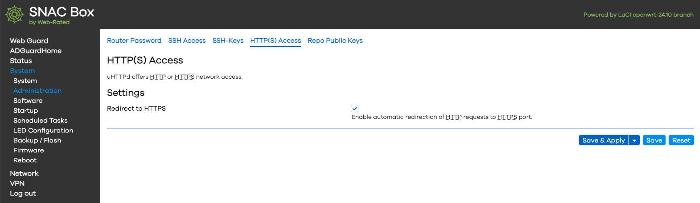
Tick 'Redirect to HTTPS'<br>
Click 'Save and Apply'
<h2>Step 10</h2>
Configure LAN IP and DHCP<br>
<br>Setup LAN IP and DHCP Range<br><br>
If connected to WAN use https://WAN_IP<br>
User = root<br>
Password = xxxxxxxx<br><br>
Click on 'Network -> Interfaces'<br>

Note: This part must be done by a device connected to the WAN port<br>
On the right hand side click on 'Edit'<br>
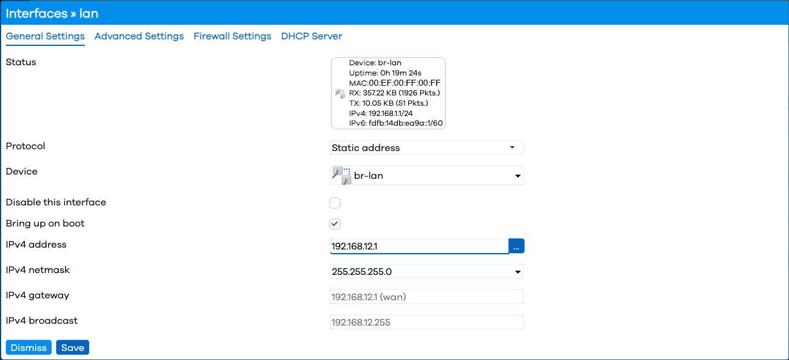
Change 'IPv4 Addresses' to '192.168.12.1'<br><br>
Click 'DHCP Server'<br>
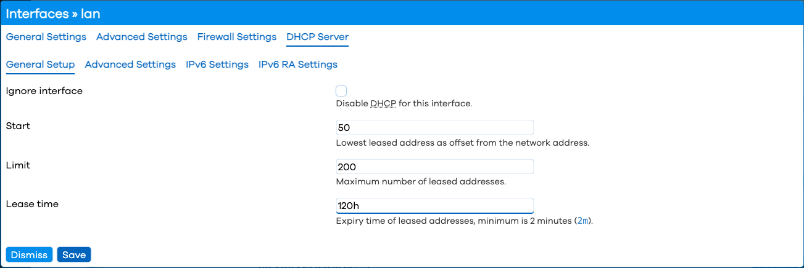
Change 'Start' to '50'<br>
Change 'Limit' to '200'<br>
Change 'Lease time' to '120h'<br><br>
Click ' Advanced Settings'<br>
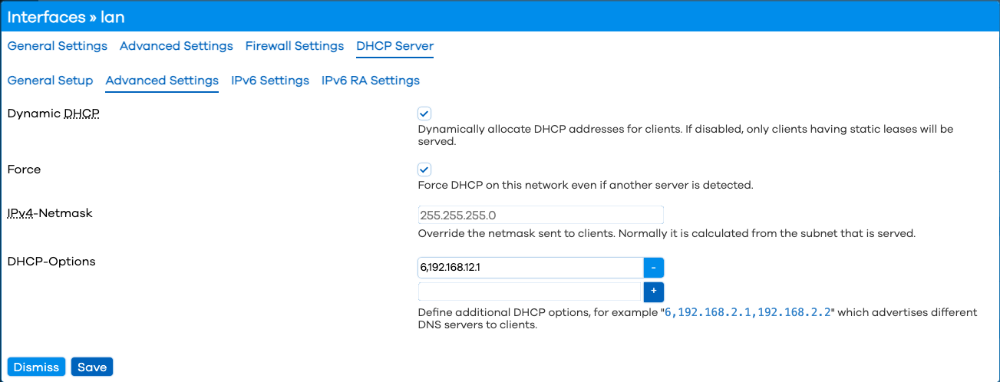
Tick 'Force'<br>
Change 'DHCP-Options' to '6,192.168.12.1'<br>
Click '+'<br>
Click 'Save'<br>
Click 'Save and Apply'

<h2>Step 11</h2>
Test SNACBox<br>
1. Login to the SNACBox web interface
2. Check 'Device Access', 'Schedule Access', 'Network -> Firewall'

<h2>Completed</h2>
At this point the SNACBox should be ready to deploy on the Home Router<br>

# Setup SNACBox on Home Network Router
Note: This is setup currently requires basic IT technical skill.<br>
<h2>Step 1</h2>
Connect SNACBox to Home Router<br>
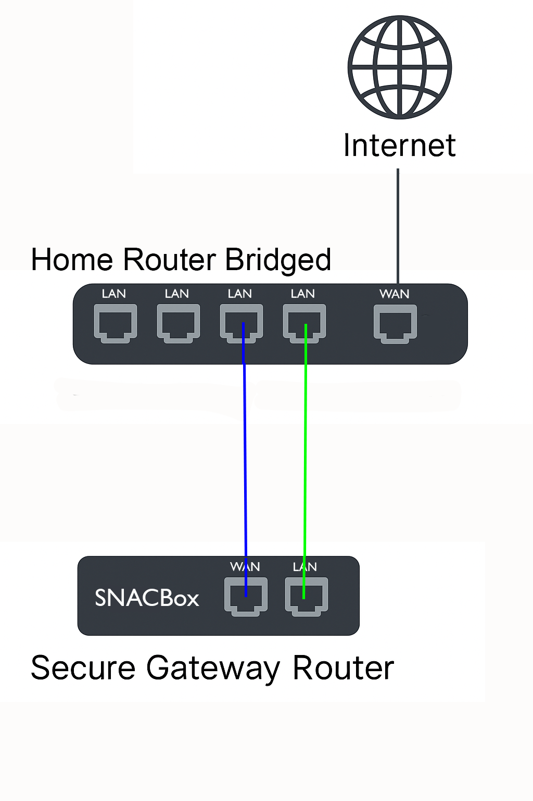
Power on SNACBox<br>
<br>Conncet Home Router eth port to SNACBox WAN port
<br>Connect SNACBox LAN port to Laptop
<br>SSH to ssh root@192.168.12.1 or Web UI to https://192.168.12.1
<br>
<br>Skip to  'Configure Static WAN' if SNACBox was made using OpenWRT image and configured manually.
<br>Only if the SNACBox-OpenWRT-0.9.42.69.img was used.

```bash
rm -f /etc/rootpt-resize /etc/rootfs-resize
sh -x /etc/uci-defaults/70-resize-rootfs
```

This will resize the use the whole SD Card. 
<br>
<br>Configure Static WAN IP (This can be the eth1's IP or another IP in the same IP range)

```bash
ifconfig -a
uci set network.eth1=interface
uci set network.eth1.ifname='eth1'
uci set network.eth1.proto='static'
uci set network.eth1cfg.ipaddr='192.168.x.x'
uci set network.eth1cfg.netmask='255.255.255.0'
uci set network.eth1cfg.gateway='192.168.x.1'
uci set network.eth1cfg.dns='127.0.0.1'
uci commit network
/etc/init.d/network restart
```

<br>Dissconnect SNACBox LAN port from Laptop
<br>Connect to home WiFi
<br>Login to Home Router and disable DHCP
<br>Note: DNS configuration my be necessary if Home Router is set to secure DNS
<br>Connect Home Router other eth port to SNACBox LAN port
<h2>Step 2</h2>
Setup Admin devices<br>
Connect at least two wireless devices (Computer, Tablet, Smart Phone) to Home WiFi<br>
If your using a mobile device IOS, MacOS or Android make sure to configure the WiFi connection's Private Wi-Fi Address to 'Fixed'<br>

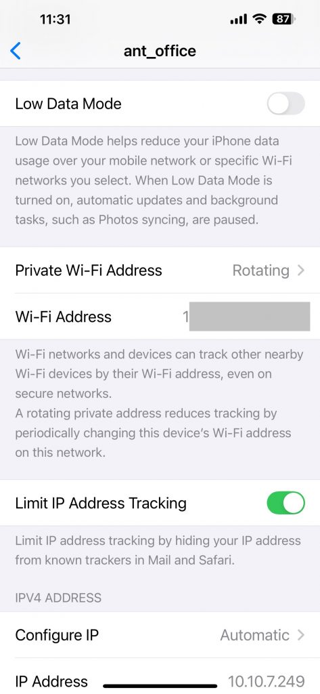<br>
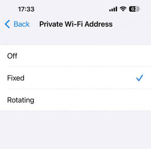

Note: These devices will automaticly be enroled into the 'No Access' rating<br>
      This is done by the New Device Access daemon installed earlier<br>
      This will have no effect as the firewall rule 'lan' and recirect 'none-rated-any' are disabled<br>
1. Open Web browser and goto http://192.168.12.1<br>
2. Login to SNACBox, User = root, Password = xxxxxx
3. Now set the Rating to '18-Rated' for both admin devices<br>


4. Once the admin devices have been enabled proceed to step 3
<h2>Step 3</h2>
Enable SNACBox security<br>
Note: This can also be done via the Web UI, 'Network -> Firewall'<br>
      'Port Forwards' tick any unticked boxes<br>
      'Traffic Rules' thick any unticked boxes<br>

<br>Enable Firewall rule 'new-rated-doc' and 'lan' and forward rule 'none-rated-any'
<br>Find the firewall rulenumber [x]

```bash
uci show firewall | grep "name='new-rated-doc'"
```
Enter number [x] of firewall rule to update

```bash
uci set firewall.@rule[x].enabled='1'
```

eg. firewall.@rule[3].name='new-rated-doc'<br>

```bash
uci show firewall | grep "name='lan'"
```
Enter number [x] of firewall rule to update

```bash
uci set firewall.@rule[x].enabled='1'
```

eg. firewall.@rule[2].name='lan'<br>
<br>Find the firewall rule or redirect number [x]

```bash
uci show firewall | grep "name='none-rated-any'"
```
Enter number [x] of firewall redirect to update

```bash
uci set firewall.@redirect[x].enabled='1'
```

eg. firewall.@redirect[1].name='none-rated-any'<br>
<br>Set updated firewall entries

```bash
uci commit firewall
/etc/init.d/firewall restart
```

<h2>Step 4</h2>
Time<br>
<br>Setup Timezone<br><br>
If connected to LAN use http://192.168.12.1<br>
If connected to WAN use http://WAN_IP<br>
User = root<br>
Password = xxxxxx<br><br>
Click on 'System -> System'<br>
Find 'Timezone' dropdown list and select the timezone<br>
<br>Reapply theme

```bash
uci set luci.main.mediaurlbase='/luci-static/snacbox-theme'
uci commit luci
service uhttpd restart
```

<h2>Device Setup</h2>
Now everthing should be setup and all devices connected to the Home WiFi should be appearing in the 'Device Access' web interface. All devices will automaticly be enroled into the 'No Access' rating<br><br>
1. Enable devices on home newtork<br>
2. https://192.168.12.1 -> Web Guard -> Web Access -> Device Access<br>
3. All devices trying to access the Home WiFi will have 'No Access' rating automaticly applied to them, but will have a 'Captive Portal' webpage appear showing there IP address.<br>

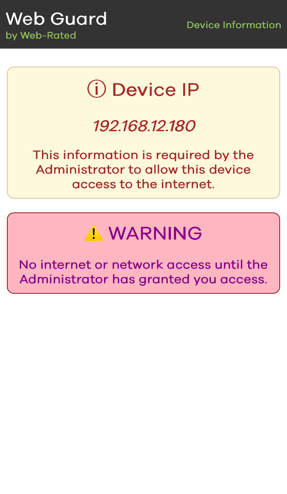<br>

4. Now find that device on the list of devices in 'Device Access' and assign it the necessary access rights (G, PG, 12, 15, 16 or 18).<br>
    The PDF contains detailed information regarding age rated filter configuration <a href="SNACBox%20Age%20Rated%20Filters.pdf">SNACBox Age Rated Filters.pdf</a>


