# Supported Hardware
<h2>Raspberry Pi CM4 SNACBox</h2>
<h3>Waveshare</h3> - https://www.waveshare.com/cm4-dual-eth-mini.htm?sku=23853 
    Mini Dual Gigabit Ethernet Base Board/Mini-Computer Designed for Raspberry Pi Compute Module 4. 
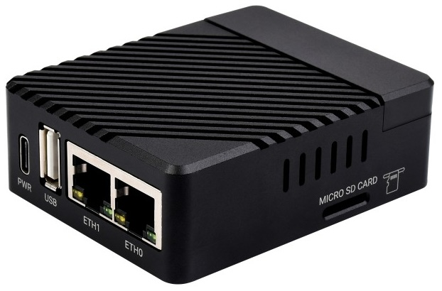     
<h3>Raspberry Pi</h3> - https://www.raspberrypi.com/products/compute-module-4/?variant=raspberry-pi-cm4001000 
    The power of Raspberry Pi 4 in a compact form factor for deeply embedded applications. Raspberry Pi Compute Module 4 incorporates a quad-core ARM Cortex-A72 processor, dual video output, and a wide selection of other interfaces 

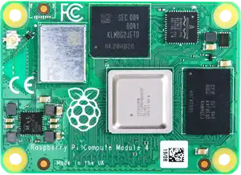 

<h2>Raspberry Pi CM5 SNACBox</h2>
<h3>Waveshare</h3> - https://www.waveshare.com/cm5-dual-eth-mini.htm?sku=31075 
    Mini Dual Gigabit Ethernet Base Board/Mini-Computer Designed for Raspberry Pi Compute Module 5. 
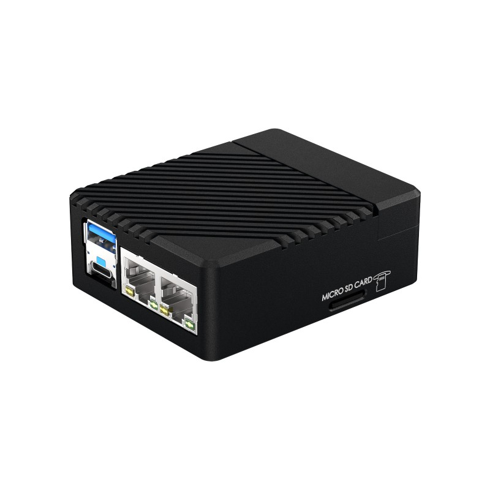    
<h3>Raspberry Pi</h3> - https://www.raspberrypi.com/products/compute-module-5/?variant=cm5-104032 
    Compute Module 5 is a powerful and scalable system on module with a 64-bit Arm processor @ 2.4GHz, an I/O controller, video and PCIe interfaces, and a range of wireless, SDRAM and eMMC options

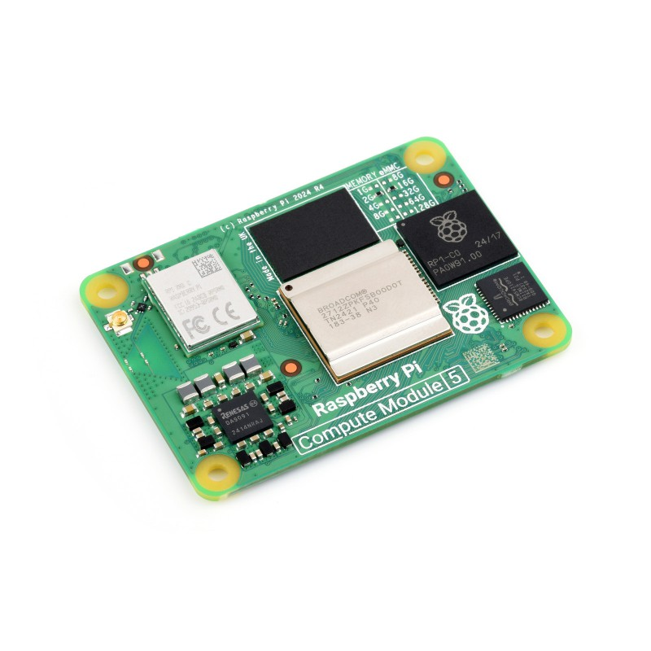

<h2>Raspberry Pi 4B SNACBox (Devolpment)</h2>
<h3>Waveshare</h3> - https://www.waveshare.com/usb-3.2-gen1-hub-gigabit-eth-hat.htm 
    USB 3.2 Gen1 and Gigabit Ethernet HUB HAT for Raspberry Pi, 3x USB 3.2 Gen1, 1x Gigabit Ethernet, driver-free. 
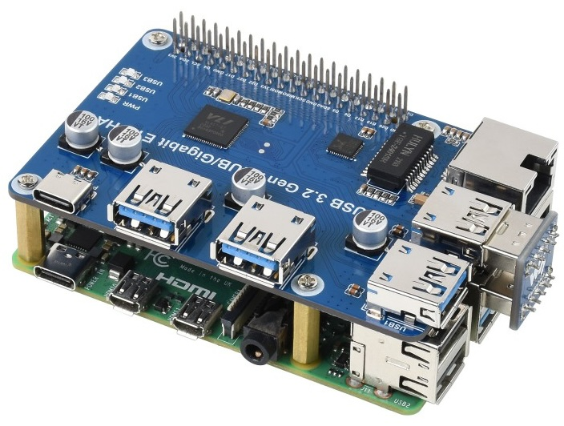 
Or 
<h3>USB Ethernet Dongle</h3>
    Needs to be a USB-A Ethernet Gigabit dongle.
<h3>Raspberry Pi</h3> - https://www.raspberrypi.com/products/raspberry-pi-4-model-b/ 
    Your tiny, dual-display, desktop computer …and robot brains, smart home hub, media centre, networked AI core, factory controller, and much more 

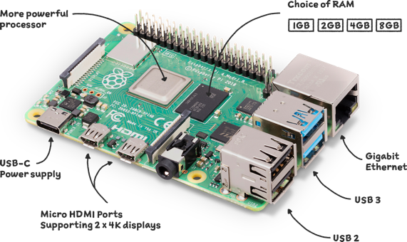

<h2>Raspberry Pi 5 SNACBox (Devolpment)</h2>
<h3>Waveshare</h3> - https://www.waveshare.com/pcie-to-gigabit-eth-usb3.2-hat-plus.htm 
    PCIe To Gigabit Ethernet And USB 3.2 Gen1 HAT For Raspberry Pi 5, 3x USB 3.2 Gen1, 1x Gigabit Ethernet, Driver-Free, Plug And Play, Raspberry Pi 5 PCIe HAT. 
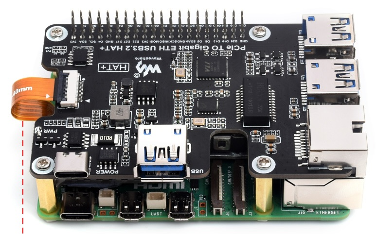 
Or 
<h3>USB Ethernet Dongle</h3>
    Needs to be a USB-A Ethernet Gigabit dongle.
<h3>Raspberry Pi</h3> - https://www.raspberrypi.com/products/raspberry-pi-5/ 
    The everything computer. Optimised. With 2–3× the speed of the previous generation, and featuring silicon designed in‑house for the best possible performance, we’ve redefined the Raspberry Pi experience. 

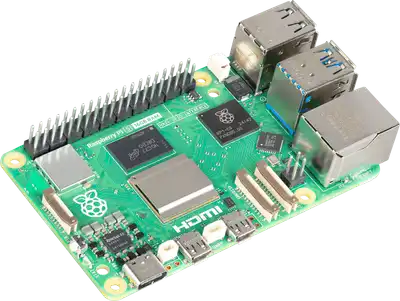

<h2>GL iNet Brume 2 (GL-MT2500) (Expermental)</h2>
<h3>Brume 2</h3> - https://store-eu.gl-inet.com/products/brume-2-gl-mt2500-vpn-security-gateway 
    Brume 2 (GL-MT2500/GL-MT2500A) is a lightweight and powerful VPN Gateway that runs on OpenWrt v21.02 operating system. It is compactly designed to host a VPN server at home, or run SD-WAN (Site-to-Site) for small and medium-sized enterprises. 
 Note: will need Luci installed to work.
    
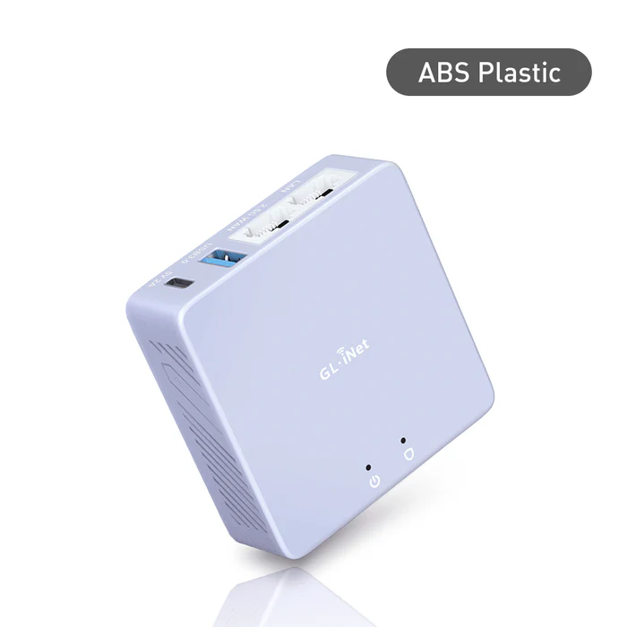 
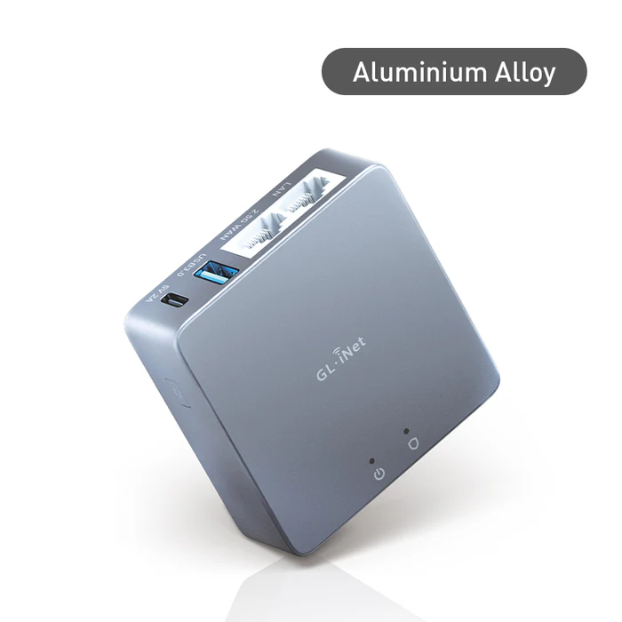 

<h2>OpenWRT One SNACBox (Expermental)</h2>
<h3>Banana Pi</h3> - https://docs.banana-pi.org/en/OpenWRT-One/BananaPi_OpenWRT-One 
    The “OpenWrt One/AP-24.XY” router board based on MediaTek MT7981B (Filogic 820) SoC and MediaTek MT7976C dual-band WiFi 6 chipset.It is the first official development board of the OpenWRT open source community 
<h3>M.2 NVME SSD M Key</h3>
    Needs a small 2230 or 2242 NVME SSD to handle the larger apps like Docker and ADGuardHome
    Note: This box has not been fully tested yet.

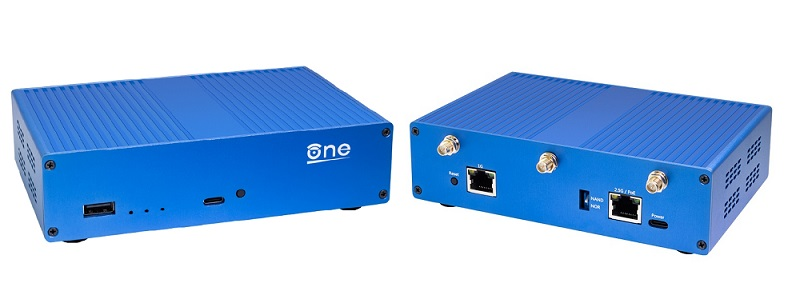
